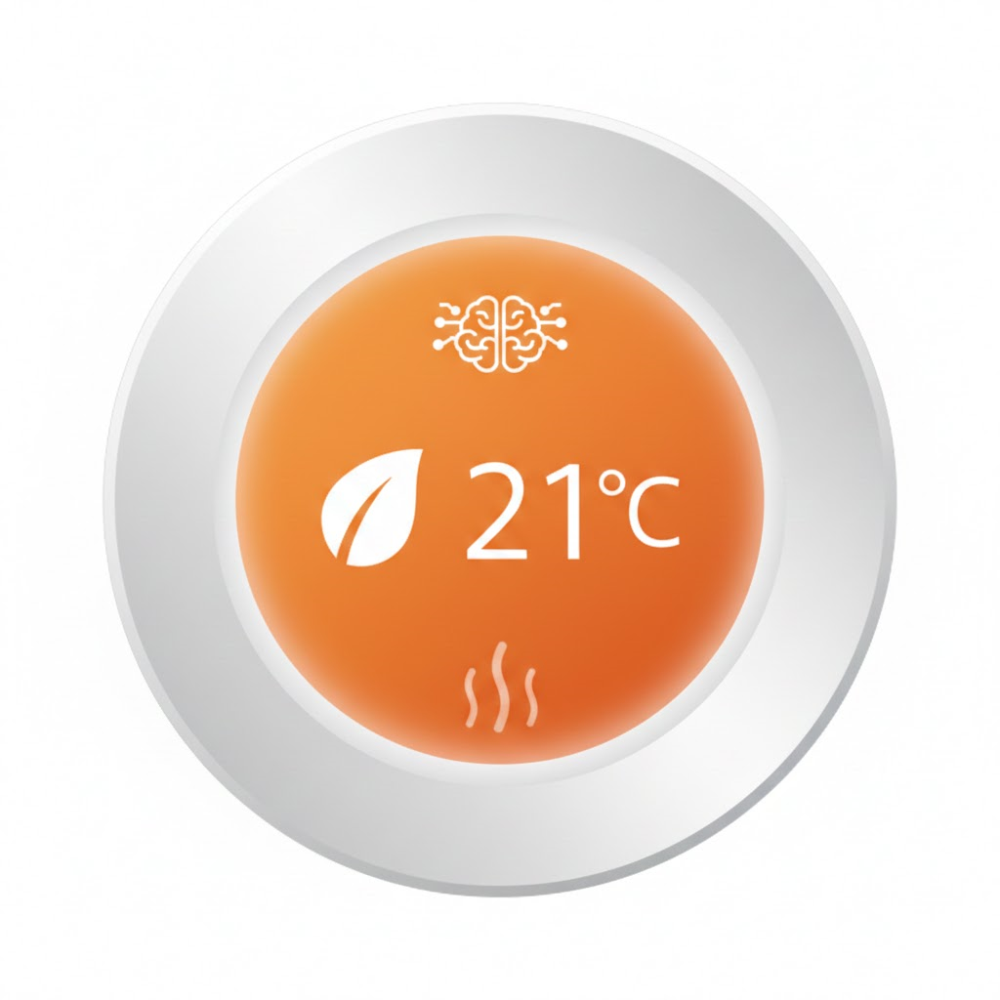

# Smart Learning Thermostat for Home Assistant



The **Smart Learning Thermostat** is a proactive heating controller for Home Assistant. Inspired by modern smart thermostats, it learns your home's thermal characteristics to ensure your rooms reach the desired temperature exactly when you need them to, while minimizing energy waste.

## 🌟 Key Features

* **Adaptive Learning**: Automatically calculates and refines your home's **Heat Up Rate** and **Heat Loss Rate** based on actual performance data.
* **Proactive Pre-heating**: Predicts how long it will take to reach your `Comfort Temperature` and starts the boiler early so your home is ready the moment your schedule begins.
* **Overshoot Protection**: Monitors "thermal lag" and shuts off the boiler before the target is reached to prevent the room from becoming too hot.
* **Intelligent Prediction**: A dedicated sensor provides the exact time for the next heating cycle, adjusted for preheating (e.g., "07:15" or "Mon 06:30").
* **Hysteresis Management**: Built-in adjustable hysteresis prevents boiler short-cycling, protecting your hardware.

## 📊 Diagnostic & Prediction Sensors

The integration automatically creates diagnostic entities to give you full visibility into your heating system's efficiency:

* **Heat Up Rate**: Measures thermal gain in **°C/min**.
* **Heat Loss Rate**: Measures how fast your room cools when the heating is off (**°C/min**).
* **Learned Overshoot**: Displays the calculated thermal overshoot in **°C**.
* **Next Fire Time**: Displays "Now" if active, "Preheating" during early starts, or a formatted timestamp for the next predicted run.

## ⚙️ Configuration Parameters

Accessible via the **Options Flow**, you can tune your thermostat without restarting:

* **Comfort Temperature**: Your target temperature for active schedule periods.
* **Setback Temperature**: The energy-saving "economy" temperature used when the schedule is off.
* **Hysteresis**: The temperature buffer to prevent frequent switching.
* **Max Boiler Runtime**: A safety watchdog that forces the boiler off if a cycle runs too long.
* **Min Burn Time**: The minimum runtime required for the system to trust and "learn" from a heating cycle.

## 📦 Installation

### HACS (Recommended)
1. Open **HACS** in your Home Assistant instance.
2. Click the three dots in the top right and select **Custom repositories**.
3. Paste your GitHub URL and select **Integration** as the category.
4. Click **Download**, then restart Home Assistant.

### Manual
1. Download the `smart_learning_thermostat` folder.
2. Copy it to your `custom_components/` directory.
3. Restart Home Assistant.

## 🚀 Getting Started

1. Navigate to **Settings** > **Devices & Services**.
2. Click **Add Integration** and search for **Smart Learning Thermostat**.
3. Define your **Heater Switch**, **Temperature Sensor**, and optional **Schedule Entity**.

## 📝 License
This project is licensed under the MIT License.

```mermaid
graph TD
    %% --- NODES & CONNECTIONS ---
    Start((Start Loop)) -->|Sensor Update / Minute Timer| SchedCheck
    
    subgraph "Phase 1: Target Determination"
        SchedCheck{"Schedule State<br>Changed?"}
        SchedCheck -- Yes --> ResetFlags["Reset Manual Mode<br>& Preheat Latch"]
        SchedCheck -- No --> ManualCheck
        ResetFlags --> ManualCheck

        ManualCheck{"Manual Mode<br>Active?"}
        ManualCheck -- Yes --> KeepUser[Keep User Set Temp]
        ManualCheck -- No --> SchedActive{"Schedule Entity<br>is ON?"}

        SchedActive -- Yes --> SetComfort[Target = Comfort Temp]
        SchedActive -- No --> PreheatEn{"Preheat<br>Enabled?"}

        PreheatEn -- No --> SetSetback[Target = Setback Temp]
        PreheatEn -- Yes --> LatchCheck{"Latch Active<br>OR<br>Calc Start Time < Now?"}

        LatchCheck -- Yes --> ActivateLatch["Set Latch = True<br>Target = Comfort Temp"]
        LatchCheck -- No --> SetSetback
    end

    %% --- OUTPUTS Phase 1 ---
    KeepUser --> CalcPoints
    SetComfort --> CalcPoints
    SetSetback --> CalcPoints
    ActivateLatch --> CalcPoints

    %% --- BOILER LOGIC ---
    subgraph "Phase 2: Boiler Control"
        CalcPoints["Calculate On/Off Points<br><i>Target - Hysteresis<br>Target - Overshoot</i>"]
        CalcPoints --> IsActive{"Boiler Currently<br>ACTIVE?"}

        %% BOILER IS ON
        IsActive -- Yes --> CheckStop{"Temp >= Target - Overshoot?"}
        CheckStop -- Yes --> BoilerOff[Turn Boiler OFF]
        CheckStop -- No --> MaxTime{"Run Time ><br>Max Limit?"}
        MaxTime -- Yes --> BoilerOff
        MaxTime -- No --> WaitOn((Keep Burning))

        %% BOILER IS OFF
        IsActive -- No --> CheckStart{"Temp <= Target - Hysteresis?"}
        CheckStart -- Yes --> BoilerOn[Turn Boiler ON]
        CheckStart -- No --> WaitOff((Keep Idle))
    end

    %% --- LEARNING LOGIC ---
    subgraph "Phase 3: Adaptive Learning"
        %% HEAT UP RATE
        BoilerOff --> LearnUp{"Check Heat Up<br>Safety Gates"}
        LearnUp -- "Burn < 10m OR<br>Rise < 0.2C" --> DiscardUp[Discard Data]
        LearnUp -- "Valid Data" --> CalcUp["Update Heat Up Rate<br><i>80% Old + 20% New</i>"]
        
        %% START TRACKING LOSS
        CalcUp --> StartLoss["Start Tracking Heat Loss<br><i>Reset Peak Temp & Timer</i>"]

        %% HEAT LOSS LOGIC
        WaitOff --> TrackPeak{"Temp > Peak?"}
        TrackPeak -- Yes --> UpdatePeak["New Peak Observed<br>Reset Timer"]
        TrackPeak -- No --> CheckCap{"Time > Max Limit?"}
        
        CheckCap -- Yes --> FinalizeCap["Calc Loss Rate &<br>Stop Tracking Cycle"]
        
        %% FINALIZE LOSS ON START
        BoilerOn --> FinalizeLoss[Calc Heat Loss Rate]
        FinalizeLoss --> StartBurn["Start Timer<br>Record Start Temp"]
    end

    %% --- STYLING DEFINITIONS ---
    classDef input fill:#e1f5fe,stroke:#01579b,stroke-width:2px,color:black;
    classDef logic fill:#fff9c4,stroke:#fbc02d,stroke-width:2px,color:black;
    classDef action fill:#e8f5e9,stroke:#2e7d32,stroke-width:2px,color:black;
    classDef learn fill:#f3e5f5,stroke:#7b1fa2,stroke-width:2px,stroke-dasharray: 5 5,color:black;
    classDef off fill:#ffebee,stroke:#c62828,stroke-width:2px,color:black;

    %% --- APPLY STYLES ---
    class SchedCheck input;
    class ResetFlags,ManualCheck,KeepUser,SchedActive,SetComfort,PreheatEn,SetSetback,LatchCheck,ActivateLatch,CalcPoints,IsActive,MaxTime,CheckStart,CheckStop logic;
    class BoilerOn,WaitOn,WaitOff action;
    class BoilerOff off;
    class LearnUp,DiscardUp,CalcUp,StartLoss,TrackPeak,UpdatePeak,CheckCap,FinalizeCap,FinalizeLoss,StartBurn learn;
